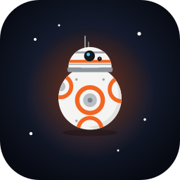
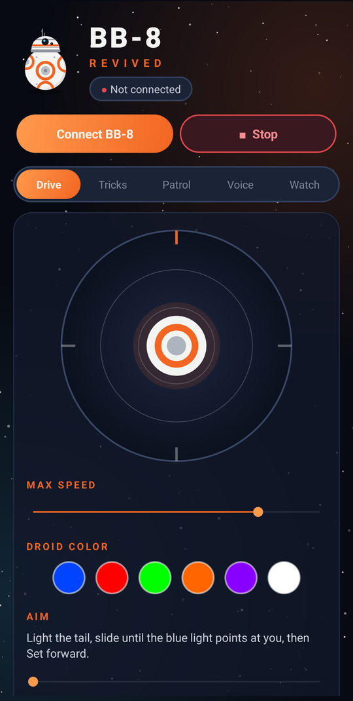
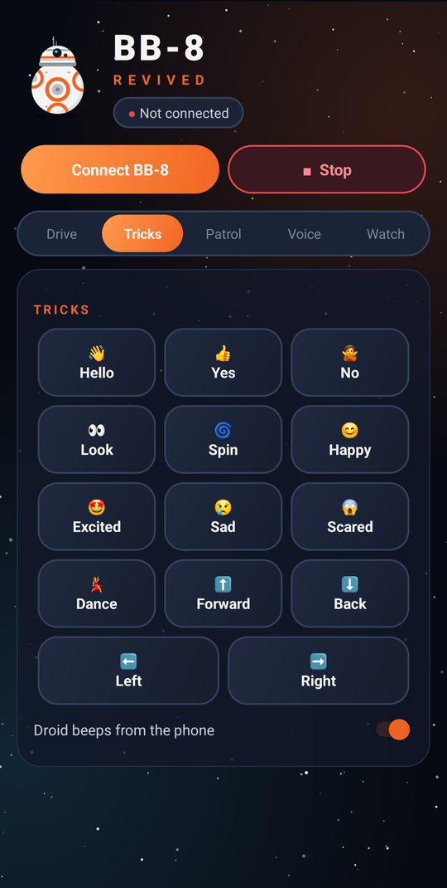

<p align="center"></p>

<h1 align="center">BB-8 Revived</h1>

<p align="center">A new Android app for the original <b>Sphero BB-8</b> (2015, model R001).<br>
The official app is gone from the stores and can't run on 64-bit-only phones like recent Pixels. This brings the droid back.</p>

<p align="center">
  
  
</p>

## Features

- **Drive** – BB-8-style joystick, max-speed slider, light colors, and tail-light aiming.
- **Tricks** – hello, yes, no, look, spin, happy, excited, sad, scared, dance and more. The phone plays droid beeps that the app synthesizes itself.
- **Patrol** – BB-8 wanders around on its own and stops now and then to look around.
- **Voice** – say "spin", "dance", "red", "patrol", "stop"…
- **Watch With Me** – BB-8 sits beside you and reacts to a movie. Loud moments picked up by the mic set it off, and you can record your own cue track (`1:02:03 excited`) that it replays on later viewings.

## Install

Download `bb8-revived.apk` from [Releases](../../releases) and open it on your phone (allow "install unknown apps").
You need Android 13 or newer with Bluetooth LE. Close Sphero Edu before connecting, because BB-8 only accepts one connection.

## Build

```sh
./gradlew testDebugUnitTest assembleDebug   # needs JDK 17+ and the Android SDK (compileSdk 34)
adb install -r app/build/outputs/apk/debug/app-debug.apk
```

The app is plain Kotlin on the Android framework, with no third-party libraries.

## How it talks to BB-8

BB-8 uses Sphero's v1 Bluetooth LE API. The old public docs (orbotix/sphero.js) are missing steps. Without them BB-8 acknowledges every command but ignores the lights and drives erratically. The sequence that works was captured from Sphero Edu with an Android HCI snoop log:

1. Write `011i3` to the anti-DoS characteristic (`22bb746f-2bbd-…`), `07` to TX power (`…2bb2…`), and `01` to wake (`…2bbf…`).
2. Turn on notifications for the response characteristic (`…2ba6…`).
3. Send `01 04` (bootloader → jump to main app), then **wait 2 s**.
4. Send `02 35 00 00 01 11` (option flags Edu sets on every connect).
5. Send commands to `…2ba1…` as **acknowledged** writes:
   - roll `02 30`: `speed, heading_hi, heading_lo, state, 00` (state 0 = stop, 1 = drive, 2 = rotate in place)
   - RGB `02 20`: `r, g, b` (no persist byte)
   - tail light `02 21`: `level`
   - set heading `02 01`: `heading_hi, heading_lo`

Packets are `FF FF DID CID SEQ DLEN DATA… CHK`, where `CHK = ~sum(DID…DATA) & 0xFF`.

## Disclaimer

This is a fan-made, unofficial project. It is not affiliated with or endorsed by Sphero, Disney or Lucasfilm.
"BB-8" and "Star Wars" are trademarks of their respective owners. All artwork in this repo is original and drawn from basic shapes.

## License

[MIT](LICENSE)
